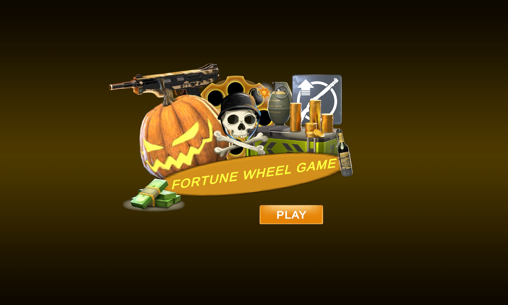

# Wheel Of Fortune - Unity Demo

A Unity mobile demo project inspired by a wheel-of-fortune reward system.  
The player spins a reward wheel, collects prizes, risks a bomb, and can choose to leave with collected rewards on safe zones.

This project was developed as a game developer demo using the provided UI assets.

---

## Revision Summary

This version includes a revised implementation based on the technical review feedback.

| Feedback | Revision |
|---|---|
| Rotation mechanic still incorrect, wheel not rotating from its centre | The rotator pivot was already centred; the cause was hand-placed slots with radii from 290 to 319 and up to 3.4° of angular drift, plus a stray -4.119° X-axis rotation on `ui_slot_01`. Slots are now placed on an exact circle in the scene and enforced at runtime by `RadialLayout` |
| Bomb rule contradicts the brief; `ReviveAfterBomb` was free, kept rewards and advanced a zone | `ReviveAfterBomb` removed. A bomb now clears the run inventory and restarts from Zone 1. Continuing is a separate paid bonus charged against the player's wallet, and it replays the same zone instead of advancing |
| No reward progression; 30 zones behaved like 3 | Currencies scale on a compounding curve per zone. Item gifts are organised into quality tiers and swapped for better gifts as zones advance |
| No currency layer; `TotalReward` was a single untyped `int` | Added a typed economy layer: `CurrencyType`, per-currency run totals, and a persistent `PlayerWallet` behind an `IWalletStorage` abstraction. Continue costs are deducted from that wallet |
| Dependency direction not inverted; scene scanning inside `OnValidate` | All `OnValidate` methods removed, all `FindObjectOfType` and `GameObject.Find` calls removed. Editor auto-wiring moved to `Reset()`. The controller now consumes nine interfaces, built by a `GameServices` composition root |
| Remaining house-rule details | `_camelCase` private fields, `Coroutine` method suffix, `SCREAMING_SNAKE_CASE` constants, `Mono` suffix on MonoBehaviours, `if (obj)` for Unity objects, no anonymous lambdas, coroutines stopped in `OnDestroy`, `[Range]`/`[Min]` on serialized numerics |
| Repository junk still committed | 174 `Assets/_MACOSX/._*` files and 25 unused icons removed, `.gitignore` and `.gitattributes` hardened |
| Collect effect looked low quality | Replaced the single scale-and-fade tween with a staggered arc flight of each reward into the wallet HUD, followed by a balance punch |

---

## Project Overview

The game is a risk-reward wheel spinning game.

The player progresses through zones by spinning the wheel. Each spin can give a reward or trigger a bomb. Rewards collected during the run are held temporarily and belong to the player only once they are banked.

If the player hits a bomb, every reward collected during that run is destroyed and the run restarts from Zone 1. The player may instead pay currency from their persistent wallet to continue, which keeps the rewards and replays the same zone.

The game includes normal zones, safe zones, and super zones.

The revised version also includes:

- Start screen before gameplay
- Left-side grouped inventory
- Top progress/zone indicator
- Safe and super zone visual feedback
- Persistent wallet HUD
- Grouped win reward popup
- Tiered gift progression
- Event bus structure
- Utility classes
- Namespace-based script organization

---

## Screenshots and Gameplay Media

### Screenshots

| Bronze Wheel Reward | Silver Wheel Reward | Start Screen |
|---|---|---|
|  |  |  |

| Bomb / Continue Popup | Reward Collection Popup |
|---|---|
|  |  |

### Gameplay Videos

- [Full 30-level gameplay video (part 1)](Media/Videos/full_fortune_wheel_30levels_part1.mp4)
- [Full 30-level gameplay video (part 2)](Media/Videos/full_fortune_wheel_30levels_part2.mp4)

---

## Aspect Ratio Screenshots

The UI was prepared to support multiple aspect ratios as required by the demo brief.

| 20:9 | 16:9 | 4:3 |
|---|---|---|
|  |  |  |

---

## Gameplay Rules

- The player starts from Zone 1.
- In normal zones, the wheel contains rewards and one bomb.
- If the wheel lands on a reward, the reward is added to the run inventory.
- If the wheel lands on a bomb, the bomb popup appears.
- **Hitting a bomb destroys every reward collected during the run and restarts from Zone 1.**
- **Continuing after a bomb is optional and costs currency from the player's wallet.** It keeps the collected rewards and replays the same zone; it never advances progress by itself.
- The continue cost rises with the zone reached and doubles with each continue already bought in the same run.
- The continue button is disabled when the player cannot afford it.
- Every 5th zone is a safe zone.
- Every 30th zone is a super zone.
- Safe and super zones do not contain bombs.
- The player can leave and collect rewards only on safe or super zones.
- **Collecting is the only action that moves rewards into the player's persistent wallet.** Everything held before that point is at risk.
- Rewards are grouped by reward category in the inventory and win popup.

---

## Implemented Features

### Core Gameplay

- Wheel spinning system
- Random reward selection
- Bomb slice logic
- Zone progression
- Safe zone logic
- Super zone logic
- Exit system
- Restart system
- Paid continue-after-bomb system
- Reward loss on bomb
- Start screen before gameplay
- Game state enum for clearer flow control

### Reward System

- Rewards are editable from the Unity Inspector
- Each wheel slice can have:
  - Reward ID
  - Reward name
  - Reward icon
  - Base reward amount
  - Reward kind (currency or item)
  - Currency type
  - Zone scaling toggle
  - Bomb state
  - Display label
- Currency rewards scale per zone on a compounding curve
- Item rewards are replaced by higher tier gifts as zones advance
- Collected rewards are stored per run and typed per currency
- Rewards are grouped by reward category and tier
- Cash from different wheels is merged into one cash entry
- Gold from different wheels is merged into one gold entry
- Final rewards are shown as grouped entries in the win popup
- Banked rewards are written into a persistent wallet

### Currency and Economy

- Multiple currencies keyed by a `CurrencyType` enum
- Separate running total per currency, with no meaningless combined figure
- Persistent player wallet saved between sessions
- Storage is abstracted behind `IWalletStorage`, so PlayerPrefs can be swapped for a server
- Continue costs are deducted from the same wallet that banked rewards are paid into
- All economy tuning lives in `Assets/Settings/GameEconomySettings.asset`

### UI Features

- Mobile portrait UI layout
- Responsive Canvas setup
- Start screen
- Wheel UI with reward slices
- Top progress/zone indicator
- Safe and super zone color feedback
- Left-side grouped inventory panel
- Scrollable inventory without visible scrollbar
- Wallet HUD showing live balances
- Bomb popup with cost and affordability feedback
- Continue button
- Restart button
- Win popup
- Grouped reward display in win popup
- Collect button
- Single reward reveal animation after each successful spin
- Smooth zone info panel scaling animation

### Visual Effects

- Reward reveal effect after a successful spin
- Flash effect behind the newly won reward
- Staggered arc flight of collected rewards into the wallet HUD
- Wallet balance punch as rewards land
- Smooth safe/super zone info scaling
- Popup overlay for better focus
- Wheel spin animation with adjusted timing and cleaned hierarchy

### Audio Support

The project supports audio clips for:

- Wheel spinning
- Reward gained
- Reward collection
- Bomb explosion

Audio clips can be assigned from the Unity Inspector on the audio service component.

---

## Controls

This is a touch/click based UI game.

| Button | Function |
|---|---|
| Start | Opens the gameplay screen |
| Spin | Spins the wheel |
| Exit | Leaves the run and opens the final reward popup on safe/super zones |
| Continue | Pays currency to survive a bomb, keeping rewards and replaying the zone |
| Restart | Abandons the run and restarts from Zone 1 |
| Collect | Plays the collection effect and banks the rewards into the wallet |

---

## Code Architecture

The revised version separates gameplay, UI, data, economy, events, utilities, audio, and animation responsibilities into different folders and classes.

```text
Assets/Scripts
├── Animation
├── Audio
├── Core
├── Data
├── Economy
├── Events
├── UI
└── Utilities
```

Every MonoBehaviour carries a `Mono` suffix, as required by the house rules. The `Economy` folder is plain C# apart from its ScriptableObjects, so the progression curve, wallet and continue pricing can be tested without the Editor.

## Main Scripts

### `WheelGameControllerMono.cs`

Coordinates the main gameplay flow.

Responsibilities:

- Starts and restarts the run
- Handles spin input
- Coordinates state changes
- Selects random wheel result
- Calls the wheel spinner
- Resolves rewards and bombs
- Handles the paid continue and the reward loss path
- Handles exit and collect logic
- Raises gameplay events
- Updates the current zone

The controller no longer contains UI logic directly, and it holds no concrete service types. Every dependency is consumed through an interface; the serialized fields exist only because Unity cannot serialize interfaces.

---

### `GameServices.cs`

Composition root for everything that does not need to be a Unity object.

Responsibilities:

- Builds the zone service, run inventory, wallet, reward resolver and continue cost policy
- Falls back to code defaults when the settings asset is unassigned
- Exposes an `Initialize(GameServices)` injection point so test doubles can be supplied

---

### `WheelSlice.cs`, `WheelConfig.cs`, `ZoneType.cs`

Wheel-related data, split into one type per file.

`WheelSlice` stores the base amount for Zone 1, plus the reward kind, currency type and a zone scaling toggle. It keeps an `InventoryKey` so rewards group consistently by category.

---

### `RunRewardInventory.cs`

Handles rewards collected during the current run.

Responsibilities:

- Stores rewards collected this run
- Groups rewards by reward ID and tier
- Tracks a separate total per currency
- Tracks collected reward count
- Provides grouped entries for UI panels
- Is cleared when a bomb resolves

There is deliberately no single total reward figure, because adding cash to gold to rifle points produces a number that means nothing.

---

### `PlayerWallet.cs`

The player's real, persistent inventory.

Responsibilities:

- Holds a balance per currency
- Holds banked item stacks
- Reports whether the player can afford a cost
- Debits the balance when continuing after a bomb
- Credits a finished run when the player collects
- Persists through `IWalletStorage`

---

### `ZoneRewardScaler.cs`

Scales currency rewards by the zone reached.

Applies `base × (1 + growth)^(zone - 1) × zoneBonus`, rounded to a readable figure by `NumberRounding`.

| Zone | 1 | 5 | 15 | 25 | 29 | 30 (super) |
|---|---|---|---|---|---|---|
| Cash | 500 | 1,100 | 3,200 | 9,200 | 9,300 | 31,000 |
| Gold | 1 | 2 | 6 | 18 | 19 | 62 |

---

### `RewardTierTable.cs`

ScriptableObject holding the gift ladder for non-currency rewards.

Item gifts are not multiplied by the zone the way currencies are; they are replaced by better gifts. This also removes the earlier oddity where a chest count scaled into "Bronze Chest x9".

---

### `ZoneTierProgression` (declared in `ITierProgression.cs`)

Decides which tier each wheel slot shows at a given zone.

One slot is promoted at a time, lowest slot first. Zone 1 shows all Tier 1 gifts, then one slot becomes Tier 2, then two, and once the whole wheel has reached a tier the sweep continues into the next one.

| Zone | Gift slots |
|---|---|
| 1 | Small Chest ¹ · Pistol Points ¹ · Bronze Chest ¹ · Knife Points ¹ · SMG Points ¹ |
| 3 | **Standard Chest ²** · Pistol Points ¹ · Bronze Chest ¹ · Knife Points ¹ · SMG Points ¹ |
| 7 | Standard Chest ² · Rifle Points ² · **Silver Chest ²** · Knife Points ¹ · SMG Points ¹ |
| 15 | **Gold Chest ³** · **Sniper Points ³** · Silver Chest ² · Shotgun Points ² · Armor Points ² |
| 23 | **Super Chest ⁴** · Sniper Points ³ · Big Chest ³ · Vest Points ³ · T1 Shotgun ³ |
| 30 | Super Chest ⁴ · T2 Rifle ⁴ · T3 Sniper ⁴ · T2 MLE ⁴ · T1 Shotgun ³ |

At the shipped `_zonesPerTierPromotion = 2`, the ladder is paced to reach near-complete Tier 4 exactly at the super zone.

---

### `TieredWheelRewardResolver.cs`

Builds the whole wheel face for a zone, applying currency scaling to currency slices and tier replacement to item slices.

The entire wheel is resolved in a single pass, and the spin awards the entry that was already drawn on the face, so the displayed reward and the granted reward cannot drift apart.

---

### `ZoneContinueCostPolicy.cs`

Prices the optional continue.

The cost rises with the zone reached and doubles with each continue already bought in the same run, so a run cannot be carried indefinitely by paying.

| Zone | 1 | 5 | 15 | 25 | 30 |
|---|---|---|---|---|---|
| First continue | 5 | 8 | 24 | 76 | 130 |
| Second continue | 10 | 16 | 49 | 150 | 270 |

---

### `ZoneService.cs`

Handles zone rules.

Responsibilities:

- Determines whether a zone is normal, safe, or super
- Determines whether the player can exit on the current zone
- Reports the next safe and next super zone

---

### `WheelConfigProviderMono.cs`

Provides the correct wheel configuration based on the current zone type.

This makes wheel setup more scalable than hardcoding normal, safe, and super wheel references directly in the controller.

---

### `GameState.cs`

Defines the main game states.

Includes:

- `Menu`
- `Idle`
- `Spinning`
- `BombDecision`
- `WinPopup`
- `Collecting`

This replaces the earlier bool-based state handling.

---

### `GameInputViewMono.cs`

Handles the persistent gameplay button input.

Responsibilities:

- Spin button event
- Exit button event
- Restart button event
- Collect button event
- Gameplay button interactability

The bomb popup's own buttons now belong to `BombPopupViewMono`, so this view no longer reaches across the hierarchy into a popup it does not own.

---

### `WheelViewMono.cs`

Handles wheel visual updates.

Responsibilities:

- Updates wheel base sprite
- Updates indicator sprite
- Updates wheel slots with the resolved rewards for the zone
- Places slots on an exact circle through `RadialLayout`
- Verifies and corrects the rotator pivot
- Provides the rotating wheel transform

---

### `WheelSlotViewMono.cs`

Controls the visual display of a single wheel slice.

Responsibilities:

- Shows reward icon
- Shows the zone-resolved reward amount
- Clears unused wheel slots

---

### `ProgressBarViewMono.cs`

Controls the top progress indicator.

Responsibilities:

- Shows nearby zone numbers
- Keeps the current indicator aligned
- Applies safe/super zone colors
- Smoothly moves and pulses the current zone marker

---

### `InventoryPanelViewMono.cs`

Controls the left-side inventory panel.

Responsibilities:

- Builds grouped inventory entries
- Uses a scrollable inventory content area
- Hides the scrollbar visually
- Prevents inventory content from overflowing outside the panel

---

### `WalletHudViewMono.cs`

Controls the persistent wallet display.

Responsibilities:

- Shows the live cash and gold balances
- Plays a scale punch as collected rewards land

---

### `ZoneInfoPanelViewMono.cs`

Controls safe/super zone information panels.

Responsibilities:

- Shows next safe zone number
- Shows next super zone number
- Smoothly scales the active safe/super panel

---

### `SingleRewardRevealViewMono.cs`

Controls the reward reveal animation after a successful spin.

Responsibilities:

- Shows the gained reward image
- Shows the reward name
- Shows the reward amount
- Plays scale and flash animation

---

### `BombPopupViewMono.cs`

Controls the bomb popup.

Responsibilities:

- States how many rewards are about to be lost
- Shows the continue cost and whether it is affordable
- Disables the continue button when the balance is short
- Raises the continue and give-up events

The title string is kept fixed and short on purpose. Its text box is 600x90 at 52pt with TMP overflow enabled, which holds about one line; a variable-length string rendered outside the rect and on top of the line 20px below it. All variable text goes to the warning line, which has room for two lines at 26pt.

---

### `WinPopupViewMono.cs`

Controls the final reward popup.

Responsibilities:

- Shows the per-currency breakdown of the run
- Builds grouped reward entries
- Displays collected rewards by category and tier
- Plays the collect flight animation

---

### `WinRewardItemViewMono.cs`

Controls each grouped reward item in the win popup.

Responsibilities:

- Shows reward icon
- Shows reward name
- Shows grouped reward amount
- Shows the currency or tier label

---

### `RewardFlight.cs`

Animation state for a single reward flying from the win popup to the wallet.

Each reward pops to 1.18x, then arcs to the wallet HUD along a quadratic bézier, staggered 0.06s apart, shrinking and tilting as it goes.

Rewards are reparented to the popup root before flying. The scroll viewport carries a `Mask` and the content a `HorizontalLayoutGroup`, either of which would otherwise clip them or snap them back mid animation.

All items are driven from one shared coroutine rather than a coroutine per item, so a popup with a dozen rewards costs a single update loop and nothing is left running if the popup is destroyed mid flight.

---

## Event Manager

The revised version includes an event bus structure.

### `GameEventBus.cs`

Centralized event publisher.

### `GameEvents.cs`

Contains gameplay event definitions.

Current events include:

- `GameStartedEvent`
- `SpinStartedEvent`
- `SpinCompletedEvent`
- `RewardCollectedEvent`
- `BombHitEvent`
- `RunLostEvent`
- `ContinuePurchasedEvent`
- `ContinueRejectedEvent`
- `RewardsBankedEvent`
- `GameRestartedEvent`
- `ZoneChangedEvent`

### `GameEventLoggerMono.cs`

Optional event listener used for debugging and verifying event flow.

The event structure makes it easier to decouple gameplay flow from systems such as logging, audio, analytics, and UI reactions.

---

## Utility Classes

### `ComponentFinder.cs`

Shared utility for finding child components by object name.

Only called from `Reset()`, never from `OnValidate()` or a runtime path, so it cannot scan the hierarchy while the game is running.

### `RadialLayout.cs`

Places wheel slots on an exact circle around the rotator pivot.

This is the code-side guard against the original rotation defect, where hand-placed slots each orbited a slightly different circle.

### `NumberRounding.cs`

Rounds scaled reward amounts to figures a player can read at a glance, snapping to two significant digits once they grow large.

### `RewardTextFormatter.cs`

Centralized text formatting for reward amounts, balances and costs.

Examples:

- `x500`
- `1,300`
- `25 GOLD`

There is deliberately no total-reward formatter, because totals are per currency.

### `GameConstants.cs`

Centralized constants for commonly used game values, in `SCREAMING_SNAKE_CASE`.

Examples:

- First zone
- Safe zone interval
- Super zone interval
- Default spin duration
- Default full rotations
- Visible progress step count
- Wheel slot radius
- Wheel indicator angle

---

## SOLID / Refactor Notes

The revised version improves separation of responsibilities:

- `WheelGameControllerMono` coordinates gameplay flow.
- `RunRewardInventory` manages the current run's rewards.
- `PlayerWallet` manages persistent balances.
- `ZoneService` manages zone logic.
- `ZoneRewardScaler` and `TieredWheelRewardResolver` manage reward progression.
- `ZoneContinueCostPolicy` manages continue pricing.
- `WheelConfigProviderMono` provides wheel configuration.
- UI view classes only handle their own UI sections.
- Utilities remove duplicated helper code.
- Event bus centralizes event publishing.
- `GameServices` acts as the composition root.

Interfaces include:

- `IZoneService`
- `IRunRewardInventory`
- `IPlayerWallet`
- `IWalletStorage`
- `IRewardScaler`
- `IWheelRewardResolver`
- `ITierProgression`
- `IContinueCostPolicy`
- `IWheelConfigProvider`
- `IAudioService`
- `IWheelSpinner`

On the previous round the interfaces existed but nothing depended on them. That has been corrected: the controller declares its dependencies as interface types and receives them from `GameServices`. An interface only satisfies the dependency inversion principle once the consumer binds to it.

### Editor-time safety

- No `OnValidate` methods anywhere in the project.
- No `FindObjectOfType` and no `GameObject.Find`.
- `AddComponent` is never called on a validation path, which removes Unity's "SendMessage cannot be called during OnValidate" warning.
- Serialized numeric fields carry `[Range]` or `[Min]`. A `spinDuration` of 0 can no longer produce NaN rotation angles.
- Every MonoBehaviour that starts a coroutine stops it in `OnDestroy`.

---

## Wheel Rotation Investigation

The review reported that the wheel still did not rotate around its centre.

The rotator itself was not at fault. `ui_transform_spin_rotator` already had a pivot of `0.5, 0.5`, an anchored position of `0, 0` and an identity rotation. The eight reward slots were the problem:

| Slot | Old radius | Old angle | Now |
|---|---|---|---|
| 01 | 319.0 | 90.0° | 305 / 90° |
| 02 | 311.5 | 47.6° | 305 / 45° |
| 03 | 300.3 | 2.5° | 305 / 0° |
| 04 | 300.7 | -43.0° | 305 / -45° |
| 05 | 290.0 | -90.0° | 305 / -90° |
| 06 | 297.3 | -137.7° | 305 / -135° |
| 07 | 306.5 | 176.6° | 305 / 180° |
| 08 | 314.8 | 133.1° | 305 / 135° |

Radii varied by 29 units and angles by up to 3.4°, and `ui_slot_01` also carried a stray -4.119° rotation on the X axis. Each icon therefore orbited a slightly different circle, which reads as the whole wheel wobbling off centre.

Making the base wheel sprite symmetric would not have fixed this, because the sprite was never the cause.

The slot transforms are corrected in the scene, and `WheelViewMono.ApplyRadialLayout()` reapplies the exact layout on `Awake` so it cannot drift again. `EnsureRotatorPivotIsCentred()` corrects and warns if the pivot is ever moved.

---

## Wheel Spin Flicker Investigation

The wheel spin animation was reviewed in the previous revision because of visible flicker during rotation.

Several approaches were tested:

- Reducing TextMeshPro auto-size and raycast overhead
- Removing unnecessary layout components from the rotating wheel
- Checking duplicate wheel rendering
- Testing single-image spin visuals
- Testing shader-based UV rotation
- Testing different spin durations and rotation counts
- Reviewing sprite import settings such as compression, filter mode, mesh type, and mip maps
- Reverting to the standard wheel rotation after heavier approaches caused performance or visual tradeoffs

The current version keeps the normal rotating wheel implementation, with a cleaned hierarchy and adjusted UI/sprite settings.

Recommended Unity settings used for wheel-related assets:

```text
Texture Type: Sprite (2D and UI)
Mesh Type: Full Rect
Image Type: Simple
Use Sprite Mesh: Off
Compression: None
Filter Mode: Bilinear
Generate Mip Maps: Off
Canvas Pixel Perfect: Off
```

---

## Designer-Facing Settings

Both assets can be edited without touching code or the scene.

### `Assets/Settings/GameEconomySettings.asset`

- Currency growth per zone
- Item growth per zone (fallback when no tier table is assigned)
- Maximum multiplier
- Safe and super zone bonuses
- Continue currency, base cost, zone growth, repeat multiplier and cost cap
- Reward tier table reference
- Zones per tier promotion
- Starting wallet balances

### `Assets/Settings/RewardTierTable.asset`

- Four gift tiers, ordered worst to best
- Each gift has an ID, display name, icon and amount

Adding a currency means adding one `CurrencyType` value; the inventory, wallet and HUD are all keyed by the enum. Adding a gift tier is an inspector change.

---

## Repository Hygiene

- `Assets/_MACOSX/` and its 174 `._*` macOS resource-fork files removed.
- 25 unused icons removed from `Assets/demo_content/`.
- `.gitignore` extended to cover `._*`, `__MACOSX/`, `_MACOSX/` and the other OS artefacts that produced the committed junk.
- `.gitattributes` extended to treat Unity YAML assets with `unityyamlmerge` and to mark binary asset types.

Note on the review's file count: `Assets/demo_content/` is not 123 irrelevant icons. It is the project's only art folder, and 36 of its files are referenced by the scene. Removing it wholesale would break the wheel, the inventory and both popups, so only the genuinely unused files were removed.

---

## Build Information

Unity version:

```text
Unity 6000.5.1f1
```

Target platform:

```text
Android
```

The APK is available from the GitHub Releases section.

---

## How to Run

1. Clone the repository.
2. Open the project with Unity 6000.5.1f1.
3. Open `Assets/Scenes/main_scene.unity`.
4. Press Play in the Unity Editor.
5. Use the Start button to enter gameplay.

The wallet persists through PlayerPrefs, so the starting balances in `GameEconomySettings` apply only on a first run. Delete the `wallet.*` PlayerPrefs keys, or call `IPlayerWallet.ResetToStartingBalances()`, to start from a clean wallet.

---

## APK

The Android APK is available in the GitHub Releases section.
