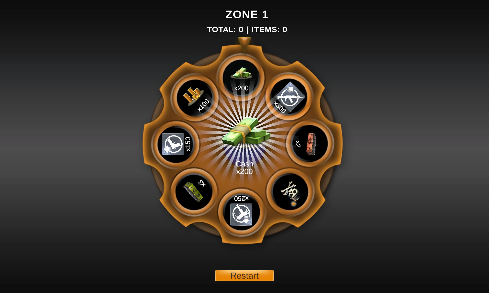
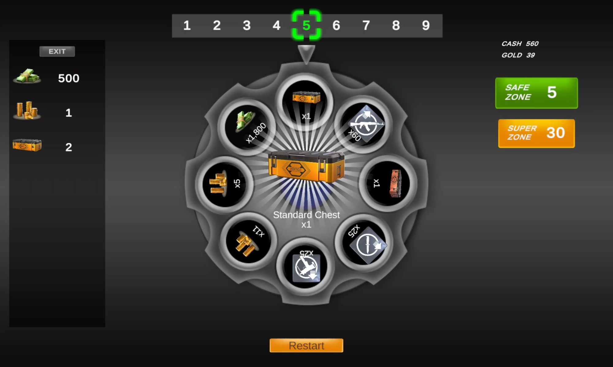
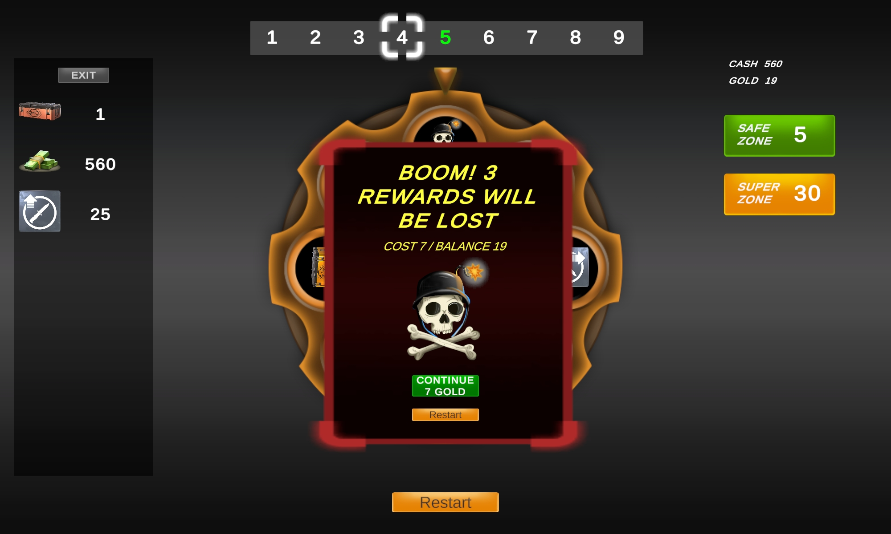
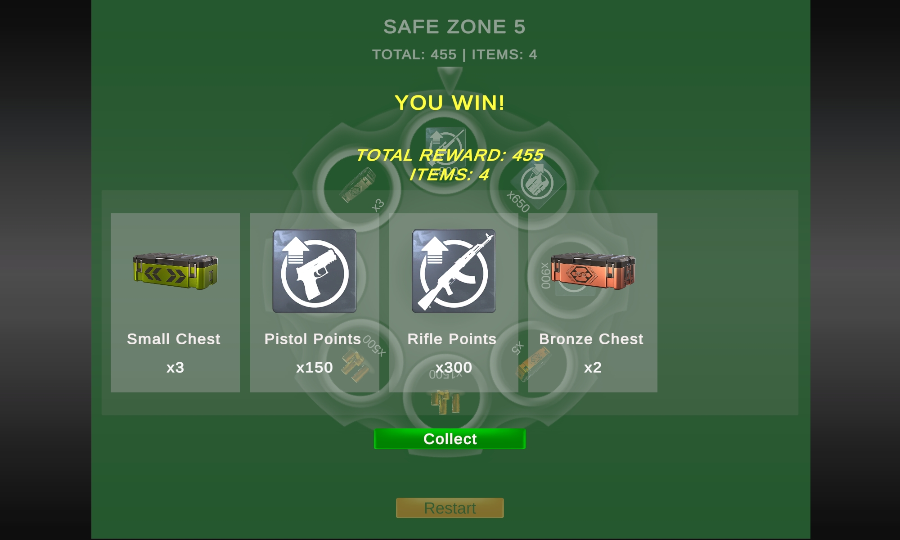
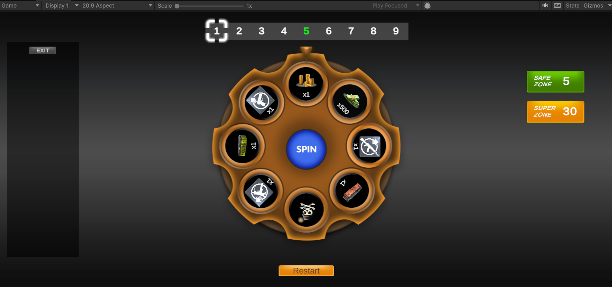
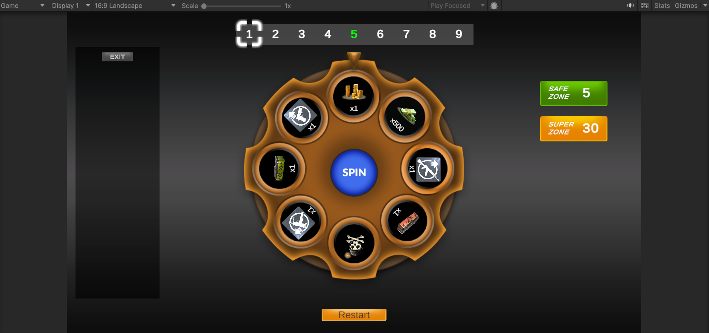
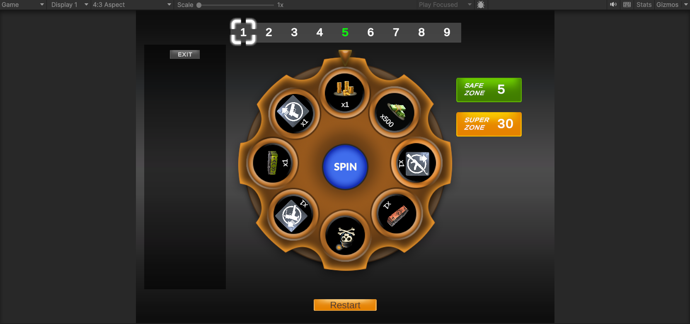

# Wheel Of Fortune - Unity Demo

A Unity mobile demo project inspired by a wheel-of-fortune reward system.  
The player spins a reward wheel, collects prizes, avoids bombs, and can choose to leave with collected rewards on safe zones.

This project was developed as a game developer demo using the provided UI assets.


## Project Overview

The game is a risk-reward wheel spinning game.

The player progresses through zones by spinning the wheel. Each spin can give a reward or trigger a bomb. Rewards collected during the run are stored temporarily. If the player hits a bomb, they can either restart or revive and continue without losing the collected rewards.

The game includes normal zones, safe zones, and super zones.

## Screenshots and Gameplay Media

### Screenshots

| Bronze Wheel Reward | Silver Wheel Reward |
|---|---|
|  |  |

| Bomb / Revive Popup | Reward Collection Popup |
|---|---|
|  |  |

### Gameplay Videos

- [Bomb appearing and revive video](Media/Videos/bomb_appearing_revive_video.mp4)
- [Reward collection video](Media/Videos/reward_collection_video.mp4)
- [Full 30-level gameplay video](Media/Videos/full_fortune_wheel_30levels.mp4)

## Aspect Ratio Screenshots

The UI was prepared to support multiple aspect ratios as required by the demo brief.

| 20:9 | 16:9 | 4:3 |
|---|---|---|
|  |  |  |

## Gameplay Rules

- The player starts from Zone 1.
- In normal zones, the wheel contains rewards and one bomb.
- If the wheel lands on a reward, the reward is added to the player's collected rewards.
- If the wheel lands on a bomb, the bomb popup appears.
- The player can revive after a bomb and continue without losing collected rewards.
- The player can restart after a bomb, which resets the run.
- Every 5th zone is a safe zone.
- Every 30th zone is a super zone.
- Safe and super zones do not contain bombs.
- The player can leave and collect rewards only when allowed by the zone rules.


## Implemented Features

### Core Gameplay

- Wheel spinning system
- Random reward selection
- Bomb slice logic
- Zone progression
- Safe zone logic
- Super zone logic
- Leave system
- Restart system
- Revive after bomb system

### Reward System

- Rewards are editable from the Unity Inspector
- Each wheel slice can have:
  - Reward name
  - Reward icon
  - Reward amount
  - Bomb state
  - Display label
- Collected rewards are stored during the run
- Rewards are shown individually when the player leaves

### UI Features

- Mobile portrait UI layout
- Responsive Canvas setup
- Wheel UI with reward slices
- Bomb popup
- Revive button
- Restart button
- Win popup
- Horizontal reward card display
- Collect button
- Reward collection animation
- Single reward reveal animation after each successful spin


### Visual Effects

- Reward reveal effect in the center after a successful spin
- Flash effect behind the newly won reward
- Collect animation for final rewards
- Popup overlay for better focus

### Audio Support

The project supports audio clips for (although not added currently but can be used when audio files are uploaded):

- Wheel spinning
- Reward gained
- Reward collection
- Bomb explosion

Audio clips can be assigned from the Unity Inspector on the `WheelGameController`.


## Controls

This is a touch/click based UI game.

| Button | Function |
|---|---|
| Spin | Spins the wheel |
| Leave | Leaves the game and opens the final reward popup |
| Revive | Continues after hitting a bomb without losing rewards |
| Restart | Restarts the game from Zone 1 |
| Collect | Plays the collection effect and restarts the run |


## Main Scripts

### `WheelData.cs`

Contains the main data classes and zone rules.

Includes:

- `ZoneType`
- `WheelSlice`
- `WheelConfig`
- `ZoneRules`

This script defines reward data, bomb data, wheel configuration, and zone type logic.


### `WheelGameController.cs`

Controls the main gameplay flow.

Responsibilities:

- Starts and restarts the game
- Handles spin input
- Selects random wheel result
- Rotates the wheel
- Resolves rewards and bombs
- Handles revive logic
- Handles leave and collect logic
- Plays audio effects
- Updates the current zone


### `GameUI.cs`

Controls UI references and UI updates.

Responsibilities:

- Updates zone text
- Updates reward totals
- Updates wheel visuals
- Shows and hides popups
- Builds the final reward card list
- Plays collect animations
- Connects UI references by object names


### `WheelSlotView.cs`

Controls the visual display of a single wheel slice.

Responsibilities:

- Shows reward icon
- Shows reward amount text
- Clears unused wheel slots


### `SingleRewardRevealView.cs`

Controls the reward reveal animation after a successful spin.

Responsibilities:

- Shows the gained reward image
- Shows the reward name
- Shows the reward amount
- Plays scale and flash animation


### `WinRewardItemView.cs`

Controls each final reward card in the win popup.

Responsibilities:

- Shows reward icon
- Shows reward name
- Shows reward amount
- Supports collect animation using CanvasGroup


## Project Structure

```text
Assets
├── Audio
│   └── Optional audio clips
├── DemoContent
│   └── Provided UI assets
├── Scenes
│   └── Main game scene
├── Scripts
│   ├── GameUI.cs
│   ├── WheelGameController.cs
│   ├── WheelData.cs
│   ├── WheelSlotView.cs
│   ├── SingleRewardRevealView.cs
│   └── WinRewardItemView.cs
└── TextMesh Pro

